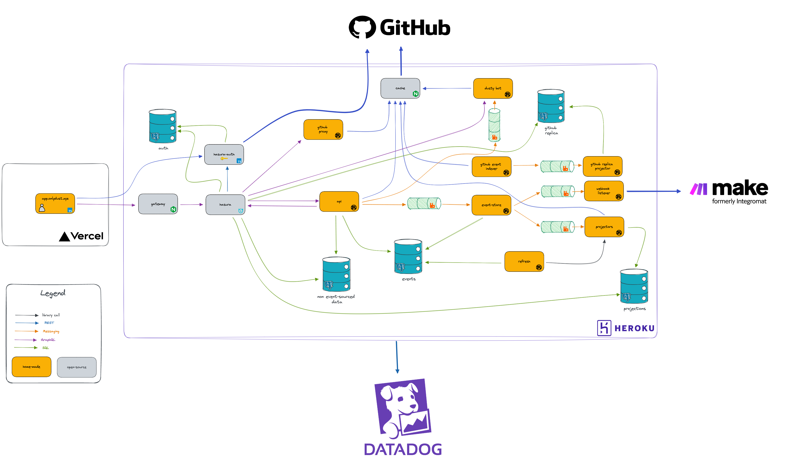
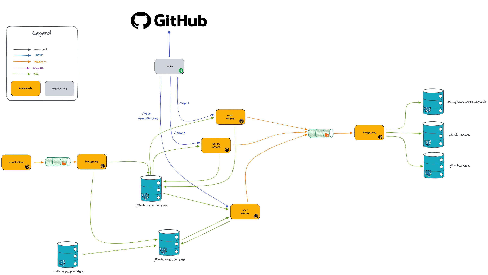

<div align="center">
  <h1 align="center">Marketplace test</h1>
  <p align="center">
    <a href="https://discord.gg/onlydust">
        
    </a>
    <a href="https://twitter.com/intent/follow?screen_name=onlydust_xyz">
        
    </a>
    <a href="https://contributions.onlydust.xyz/">
        
    </a>
    <a href="https://codecov.io/gh/onlydustxyz/marketplace" > 
        
    </a>
    
  </p>
  
  <h3 align="center">Marketplace backend</h3>

</h3>
</div>

> ## ⚠️ WARNING! ⚠️
>
> This repo contains highly experimental code.
> Expect rapid iteration.

# Global architecture



# Github indexing



# Data Diagram

[Data Diagram](./doc/data_diagram.md)

# Development

## 🎗️ Prerequisites

-   [docker](https://docs.docker.com/get-docker/)

Install rust and the dependencies:

```sh
make install
```

## Usage

First, prepare your local environment by configuring your `.env`. Copy the `.env.example` file and replace the values tagged with `REPLACE_AT_INSTALLATION` according to your personal accounts.

```sh
cp .env.example .env
```

The [Makefile](./Makefile) contains all commands you may need. Please check it.

Examples:

```sh
make fmt                # Check code formatting
make check              # Check for compile errors
make clippy             # Run the linter
make                    # build the application
make unit-tests         # Run the unit tests
make integration-tests  # Run the integration tests
```

Or run the backend in local, each in a dedicated terminal:

```sh
make api
make github-indexer
```

## Migrate database

First install diesel CLI

```sh
brew install libpq
brew link --force libpq
PQ_LIB_DIR="$(brew --prefix libpq)/lib"
cargo install diesel_cli --no-default-features --features postgres
```

-   To create a new migration, start running

```
diesel migration generate <your-migration-name>
```

-   Edit the generated files with your SQL code for `up.sql` and `down.sql`
-   Test your migration up and down by running

```
diesel migration run
diesel migration revert
diesel migration run
```

-   The file `schema.rs` should be then automatically updated

## Security

To activate the GitGuardian pre-commit, you need first to connect to GitGuardian :

-   follow the GitGuardian documentation to install their CLI : https://docs.gitguardian.com/ggshield-docs/getting-started
-   authenticate to GitGuardian by running `ggshield auth login`

Then, install GitGuardian pre-commit hook to check if some secrets are leaked inside the code base :

run `pre-commit install`

## Monitoring

We use Datadog as a monitoring solution.
Datadog agents and drains are configured using Terraform.

# 📄 License

**marketplace** is released under [MIT](LICENSE).
