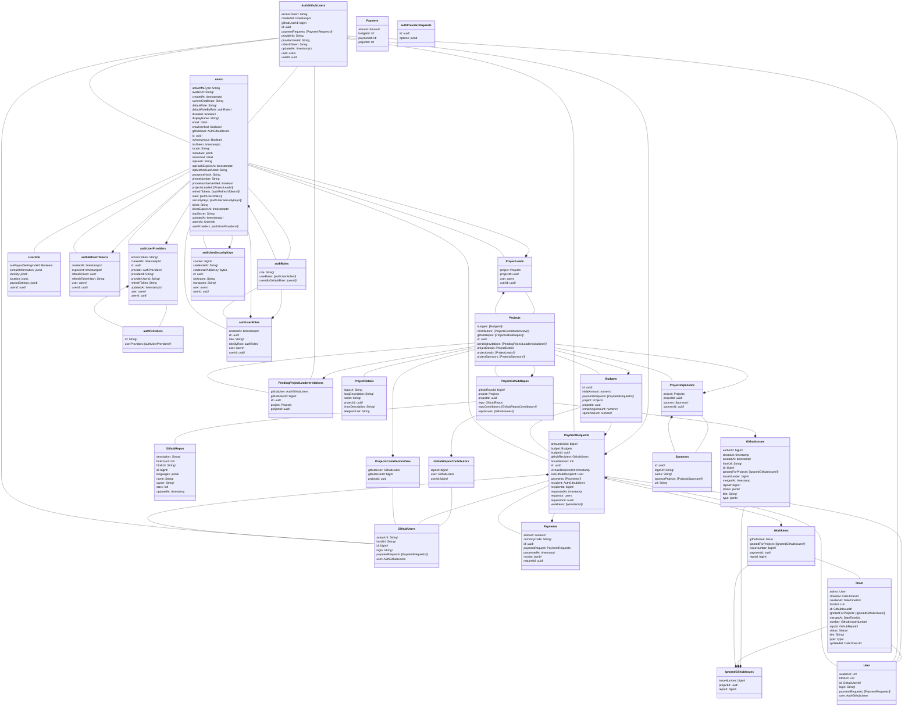

# Data diagram

```mermaid
classDiagram

class AuthGithubUsers {
   accessToken: String
   createdAt: timestamptz
   githubUserId: bigint
   id: uuid
   paymentRequests: [PaymentRequests!]!
   providerId: String
   providerUserId: String
   refreshToken: String
   updatedAt: timestamptz
   user: users
   userId: uuid
}

class Budgets {
   id: uuid!
   initialAmount: numeric!
   paymentRequests: [PaymentRequests!]!
   project: Projects
   projectId: uuid
   remainingAmount: numeric!
   spentAmount: numeric!
}

class GithubIssues {
   authorId: bigint!
   closedAt: timestamp
   createdAt: timestamp!
   htmlUrl: String!
   id: bigint!
   ignoredForProjects: [IgnoredGithubIssues!]!
   issueNumber: bigint!
   mergedAt: timestamp
   repoId: bigint!
   status: jsonb!
   title: String!
   type: jsonb!
}

class GithubRepos {
   description: String!
   forkCount: Int!
   htmlUrl: String!
   id: bigint!
   languages: jsonb!
   name: String!
   owner: String!
   stars: Int!
   updatedAt: timestamp
}

class GithubReposContributors {
   repoId: bigint!
   user: GithubUsers
   userId: bigint!
}

class GithubUsers {
   avatarUrl: String!
   htmlUrl: String!
   id: bigint!
   login: String!
   paymentRequests: [PaymentRequests!]!
   user: AuthGithubUsers
}

class IgnoredGithubIssues {
   issueNumber: bigint!
   projectId: uuid!
   repoId: bigint!
}

class Issue {
   author: User!
   closedAt: DateTimeUtc
   createdAt: DateTimeUtc!
   htmlUrl: Url!
   id: GithubIssueId!
   ignoredForProjects: [IgnoredGithubIssues!]!
   mergedAt: DateTimeUtc
   number: GithubIssueNumber!
   repoId: GithubRepoId!
   status: Status!
   title: String!
   type: Type!
   updatedAt: DateTimeUtc!
}

class Payment {
   amount: Amount!
   budgetId: Id!
   paymentId: Id!
   projectId: Id!
}

class PaymentRequests {
   amountInUsd: bigint!
   budget: Budgets
   budgetId: uuid!
   githubRecipient: GithubUsers
   hoursWorked: Int!
   id: uuid!
   invoiceReceivedAt: timestamp
   liveGithubRecipient: User
   payments: [Payments!]!
   recipient: AuthGithubUsers
   recipientId: bigint!
   requestedAt: timestamp!
   requestor: users
   requestorId: uuid!
   workItems: [WorkItems!]!
}

class Payments {
   amount: numeric!
   currencyCode: String!
   id: uuid!
   paymentRequest: PaymentRequests
   processedAt: timestamp!
   receipt: jsonb!
   requestId: uuid!
}

class PendingProjectLeaderInvitations {
   githubUser: AuthGithubUsers
   githubUserId: bigint!
   id: uuid!
   project: Projects
   projectId: uuid!
}

class ProjectDetails {
   logoUrl: String
   longDescription: String!
   name: String!
   projectId: uuid!
   shortDescription: String!
   telegramLink: String
}

class ProjectGithubRepos {
   githubRepoId: bigint!
   project: Projects
   projectId: uuid!
   repo: GithubRepos
   repoContributors: [GithubReposContributors!]!
   repoIssues: [GithubIssues!]!
}

class ProjectLeads {
   project: Projects
   projectId: uuid!
   user: users
   userId: uuid!
}

class Projects {
   budgets: [Budgets!]!
   contributors: [ProjectsContributorsView!]!
   githubRepos: [ProjectGithubRepos!]!
   id: uuid!
   pendingInvitations: [PendingProjectLeaderInvitations!]!
   projectDetails: ProjectDetails
   projectLeads: [ProjectLeads!]!
   projectSponsors: [ProjectsSponsors!]!
}

class ProjectsContributorsView {
   githubUser: GithubUsers
   githubUserId: bigint
   projectId: uuid
}

class ProjectsSponsors {
   project: Projects!
   projectId: uuid!
   sponsor: Sponsors!
   sponsorId: uuid!
}

class Sponsors {
   id: uuid!
   logoUrl: String!
   name: String!
   sponsorProjects: [ProjectsSponsors!]!
   url: String
}

class User {
   avatarUrl: Url!
   htmlUrl: Url!
   id: GithubUserId!
   login: String!
   paymentRequests: [PaymentRequests!]!
   user: AuthGithubUsers
}

class UserInfo {
   arePayoutSettingsValid: Boolean!
   contactInformation: jsonb
   identity: jsonb
   location: jsonb
   payoutSettings: jsonb
   userId: uuid!
}

class WorkItems {
   githubIssue: Issue
   ignoredForProjects: [IgnoredGithubIssues!]!
   issueNumber: bigint!
   paymentId: uuid!
   repoId: bigint!
}

class authProviderRequests {
   id: uuid!
   options: jsonb
}

class authProviders {
   id: String!
   userProviders: [authUserProviders!]!
}

class authRefreshTokens {
   createdAt: timestamptz!
   expiresAt: timestamptz!
   refreshToken: uuid!
   refreshTokenHash: String
   user: users!
   userId: uuid!
}

class authRoles {
   role: String!
   userRoles: [authUserRoles!]!
   usersByDefaultRole: [users!]!
}

class authUserProviders {
   accessToken: String!
   createdAt: timestamptz!
   id: uuid!
   provider: authProviders!
   providerId: String!
   providerUserId: String!
   refreshToken: String
   updatedAt: timestamptz!
   user: users!
   userId: uuid!
}

class authUserRoles {
   createdAt: timestamptz!
   id: uuid!
   role: String!
   roleByRole: authRoles!
   user: users!
   userId: uuid!
}

class authUserSecurityKeys {
   counter: bigint!
   credentialId: String!
   credentialPublicKey: bytea
   id: uuid!
   nickname: String
   transports: String!
   user: users!
   userId: uuid!
}

class users {
   activeMfaType: String
   avatarUrl: String!
   createdAt: timestamptz!
   currentChallenge: String
   defaultRole: String!
   defaultRoleByRole: authRoles!
   disabled: Boolean!
   displayName: String!
   email: citext
   emailVerified: Boolean!
   githubUser: AuthGithubUsers
   id: uuid!
   isAnonymous: Boolean!
   lastSeen: timestamptz
   locale: String!
   metadata: jsonb
   newEmail: citext
   otpHash: String
   otpHashExpiresAt: timestamptz!
   otpMethodLastUsed: String
   passwordHash: String
   phoneNumber: String
   phoneNumberVerified: Boolean!
   projectsLeaded: [ProjectLeads!]!
   refreshTokens: [authRefreshTokens!]!
   roles: [authUserRoles!]!
   securityKeys: [authUserSecurityKeys!]!
   ticket: String
   ticketExpiresAt: timestamptz!
   totpSecret: String
   updatedAt: timestamptz!
   userInfo: UserInfo
   userProviders: [authUserProviders!]!
}

AuthGithubUsers -- users
AuthGithubUsers --* PaymentRequests
Budgets -- Projects
Budgets --* PaymentRequests
GithubIssues --* IgnoredGithubIssues
GithubReposContributors -- GithubUsers
GithubUsers -- AuthGithubUsers
GithubUsers --* PaymentRequests
Issue -- User
Issue --* IgnoredGithubIssues
PaymentRequests -- AuthGithubUsers
PaymentRequests -- Budgets
PaymentRequests -- GithubUsers
PaymentRequests -- User
PaymentRequests -- users
PaymentRequests --* Payments
PaymentRequests --* WorkItems
Payments -- PaymentRequests
PendingProjectLeaderInvitations -- AuthGithubUsers
PendingProjectLeaderInvitations -- Projects
ProjectGithubRepos -- GithubRepos
ProjectGithubRepos -- Projects
ProjectGithubRepos --* GithubIssues
ProjectGithubRepos --* GithubReposContributors
ProjectLeads -- Projects
ProjectLeads -- users
Projects -- ProjectDetails
Projects --* Budgets
Projects --* PendingProjectLeaderInvitations
Projects --* ProjectGithubRepos
Projects --* ProjectLeads
Projects --* ProjectsContributorsView
Projects --* ProjectsSponsors
ProjectsContributorsView -- GithubUsers
ProjectsSponsors -- Projects
ProjectsSponsors -- Sponsors
Sponsors --* ProjectsSponsors
User -- AuthGithubUsers
User --* PaymentRequests
WorkItems -- Issue
WorkItems --* IgnoredGithubIssues
authProviders --* authUserProviders
authRefreshTokens -- users
authRoles --* authUserRoles
authRoles --* users
authUserProviders -- authProviders
authUserProviders -- users
authUserRoles -- authRoles
authUserRoles -- users
authUserSecurityKeys -- users
users -- AuthGithubUsers
users -- UserInfo
users -- authRoles
users --* ProjectLeads
users --* authRefreshTokens
users --* authUserProviders
users --* authUserRoles
users --* authUserSecurityKeys
```
