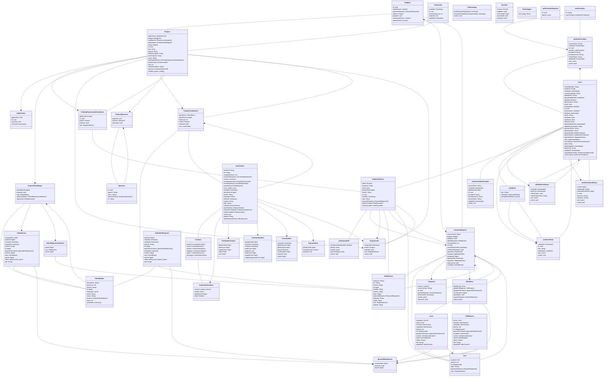

# Data diagram

```mermaid
classDiagram

class Applications {
   applicantId: uuid!
   id: uuid!
   projectId: uuid!
   receivedAt: timestamp!
}

class AuthUserGithubProvider {
   accessToken: String
   createdAt: timestamptz
   githubUserId: bigint
   id: uuid
   providerId: String
   providerUserId: String
   refreshToken: String
   updatedAt: timestamptz
   userId: uuid
}

class Budgets {
   id: uuid!
   initialAmount: numeric!
   paymentRequests: [PaymentRequests!]!
   project: Projects
   projectId: uuid
   remainingAmount: numeric!
   spentAmount: numeric!
}

class Commands {
   createdAt: timestamp
   id: uuid
   processingCount: Int
   projectId: uuid
   updatedAt: timestamp
}

class ContactInformations {
   channel: contact_channel
   contact: String
   githubUserId: bigint
   public: Boolean
}

class Contacts {
   discord: ContactInformations
   email: ContactInformations
   linkedin: ContactInformations
   telegram: ContactInformations
   twitter: ContactInformations
   whatsapp: ContactInformations
}

class ContributionCounts {
   githubUserId: bigint
   paidCount: bigint
   unpaidCount: bigint
   week: float8
   year: float8
}

class ContributionStats {
   githubUserId: bigint
   maxDate: timestamp
   minDate: timestamp
   paidCount: bigint
   projectId: uuid
   totalCount: bigint
   unpaidCount: bigint
   unpaidUnignoredCount: bigint
}

class Contributions {
   createdAt: timestamp
   githubIssueId: bigint
   githubUserId: bigint
   ignored: Boolean
   issueNumber: bigint
   projectId: uuid
   repoId: bigint
}

class GithubIssues {
   assigneeIds: jsonb!
   authorId: bigint!
   closedAt: timestamp
   createdAt: timestamp!
   htmlUrl: String!
   id: bigint!
   ignoredForProjects: [IgnoredGithubIssues!]!
   number: bigint!
   repo: GithubRepos
   repoId: bigint!
   status: github_issue_status!
   title: String!
}

class GithubPullRequests {
   authorId: bigint!
   closedAt: timestamp
   createdAt: timestamp!
   htmlUrl: String!
   id: bigint!
   ignoredForProjects: [IgnoredGithubIssues!]!
   mergedAt: timestamp
   number: bigint!
   repo: GithubRepos
   repoId: bigint!
   status: github_pull_request_status!
   title: String!
}

class GithubRepos {
   description: String!
   forkCount: Int!
   htmlUrl: String!
   id: bigint!
   languages: jsonb!
   name: String!
   owner: String!
   projects: [ProjectGithubRepos!]!
   stars: Int!
   updatedAt: timestamp
}

class GithubReposContributors {
   repoId: bigint!
   user: GithubUsers
   userId: bigint!
}

class GithubUsers {
   avatarUrl: String!
   bio: String
   htmlUrl: String!
   id: bigint!
   linkedin: String
   location: String
   login: String!
   paymentRequests: [PaymentRequests!]!
   telegram: String
   twitter: String
   user: RegisteredUsers
   website: String
}

class IgnoredGithubIssues {
   issueNumber: bigint!
   projectId: uuid!
   repoId: bigint!
}

class Issue {
   assignees: [User!]!
   author: User!
   closedAt: DateTimeUtc
   createdAt: DateTimeUtc!
   htmlUrl: Url!
   id: GithubIssueId!
   ignoredForProjects: [IgnoredGithubIssues!]!
   number: GithubIssueNumber!
   repoId: GithubRepoId!
   status: Status!
   title: String!
   updatedAt: DateTimeUtc!
}

class Onboardings {
   profileWizardDisplayDate: timestamp
   termsAndConditionsAcceptanceDate: timestamp
   userId: uuid!
}

class Payment {
   amount: Amount!
   budgetId: Uuid!
   commandId: Uuid!
   paymentId: Uuid!
   projectId: Uuid!
}

class PaymentRequests {
   amountInUsd: bigint!
   budget: Budgets
   budgetId: uuid!
   githubRecipient: GithubUsers
   hoursWorked: Int!
   id: uuid!
   invoiceReceivedAt: timestamp
   liveGithubRecipient: User
   payments: [Payments!]!
   recipient: RegisteredUsers
   recipientId: bigint!
   requestedAt: timestamp!
   requestor: RegisteredUsers
   requestorId: uuid!
   workItems: [WorkItems!]!
}

class PaymentStats {
   githubUserId: bigint
   moneyGranted: numeric
   projectId: uuid
}

class Payments {
   amount: numeric!
   currencyCode: String!
   id: uuid!
   paymentRequest: PaymentRequests
   processedAt: timestamp!
   receipt: jsonb!
   requestId: uuid!
}

class PendingProjectLeaderInvitations {
   githubUserId: bigint!
   id: uuid!
   project: Projects
   projectId: uuid!
   user: RegisteredUsers
}

class ProjectGithubRepos {
   githubRepoId: bigint!
   projectId: uuid!
   repo: GithubRepos
   repoContributors: [GithubReposContributors!]!
   repoIssues: [GithubIssues!]!
}

class ProjectLeads {
   assignedAt: timestamp!
   project: Projects
   projectId: uuid!
   user: RegisteredUsers
   userId: uuid!
}

class Projects {
   applications: [Applications!]!
   budgets: [Budgets!]!
   contributors: [ProjectsContributors!]!
   githubRepos: [ProjectGithubRepos!]!
   hiring: Boolean
   id: uuid
   key: String
   logoUrl: String
   longDescription: String
   moreInfoLink: String
   name: String
   pendingInvitations: [PendingProjectLeaderInvitations!]!
   projectLeads: [ProjectLeads!]!
   rank: Int
   shortDescription: String
   sponsors: [ProjectsSponsors!]!
   visibility: project_visibility
}

class ProjectsContributors {
   githubUser: GithubUsers
   githubUserId: bigint!
   linkCount: Int!
   project: Projects
   projectId: uuid!
   user: UserProfiles
}

class ProjectsSponsors {
   projectId: uuid!
   sponsor: Sponsors!
   sponsorId: uuid!
}

class PullRequest {
   author: User!
   closedAt: DateTimeUtc
   createdAt: DateTimeUtc!
   htmlUrl: Url!
   id: GithubIssueId!
   ignoredForProjects: [IgnoredGithubIssues!]!
   mergedAt: DateTimeUtc
   number: GithubIssueNumber!
   repoId: GithubRepoId!
   status: Status!
   title: String!
   updatedAt: DateTimeUtc!
}

class RegisteredUsers {
   admin: Boolean
   avatarUrl: String
   email: citext
   githubUserId: bigint
   htmlUrl: String
   id: uuid
   lastSeen: timestamp
   login: String
   paymentRequests: [PaymentRequests!]!
   projectsLeaded: [ProjectLeads!]!
   userPayoutInfo: UserPayoutInfo
}

class Sponsors {
   id: uuid!
   logoUrl: String!
   name: String!
   sponsorProjects: [ProjectsSponsors!]!
   url: String
}

class Technologies {
   technology: String
}

class User {
   avatarUrl: Url!
   htmlUrl: Url!
   id: GithubUserId!
   login: String!
   paymentRequests: [PaymentRequests!]!
   user: RegisteredUsers
}

class UserPayoutInfo {
   arePayoutSettingsValid: Boolean!
   identity: jsonb
   location: jsonb
   payoutSettings: jsonb
   userId: uuid!
}

class UserProfiles {
   avatarUrl: String
   bio: String
   completionScore: Int!
   contactInformations: [ContactInformations!]!
   contacts: Contacts!
   contributionCounts: [ContributionCounts!]!
   contributionStats: [ContributionStats!]!
   contributions: [Contributions!]!
   cover: profile_cover
   createdAt: timestamp
   githubUserId: bigint
   htmlUrl: String
   languages: jsonb
   lastSeen: timestamp
   location: String
   login: String
   lookingForAJob: Boolean
   paymentStats: [PaymentStats!]!
   projectsContributed: [ProjectsContributors!]!
   projectsLeaded: [ProjectLeads!]!
   userId: uuid
   website: String
   weeklyAllocatedTime: allocated_time
}

class WorkItems {
   githubIssue: Issue
   githubPullRequest: PullRequest
   ignoredForProjects: [IgnoredGithubIssues!]!
   issueNumber: bigint!
   paymentId: uuid!
   paymentRequest: PaymentRequests
   repoId: bigint!
}

class authProviderRequests {
   id: uuid!
   options: jsonb
}

class authProviders {
   id: String!
   userProviders: [authUserProviders!]!
}

class authRefreshTokens {
   createdAt: timestamptz!
   expiresAt: timestamptz!
   refreshToken: uuid!
   refreshTokenHash: String
   user: users!
   userId: uuid!
}

class authRoles {
   role: String!
   userRoles: [authUserRoles!]!
   usersByDefaultRole: [users!]!
}

class authUserProviders {
   accessToken: String!
   createdAt: timestamptz!
   id: uuid!
   provider: authProviders!
   providerId: String!
   providerUserId: String!
   refreshToken: String
   updatedAt: timestamptz!
   user: users!
   userId: uuid!
}

class authUserRoles {
   createdAt: timestamptz!
   id: uuid!
   role: String!
   roleByRole: authRoles!
   user: users!
   userId: uuid!
}

class authUserSecurityKeys {
   counter: bigint!
   credentialId: String!
   credentialPublicKey: bytea
   id: uuid!
   nickname: String
   transports: String!
   user: users!
   userId: uuid!
}

class users {
   activeMfaType: String
   avatarUrl: String!
   createdAt: timestamptz!
   currentChallenge: String
   defaultRole: String!
   defaultRoleByRole: authRoles!
   disabled: Boolean!
   displayName: String!
   email: citext
   emailVerified: Boolean!
   id: uuid!
   isAnonymous: Boolean!
   lastSeen: timestamptz
   locale: String!
   metadata: jsonb
   newEmail: citext
   otpHash: String
   otpHashExpiresAt: timestamptz!
   otpMethodLastUsed: String
   passwordHash: String
   phoneNumber: String
   phoneNumberVerified: Boolean!
   refreshTokens: [authRefreshTokens!]!
   registeredUser: RegisteredUsers
   roles: [authUserRoles!]!
   securityKeys: [authUserSecurityKeys!]!
   ticket: String
   ticketExpiresAt: timestamptz!
   totpSecret: String
   updatedAt: timestamptz!
   userGithubProvider: AuthUserGithubProvider
   userProviders: [authUserProviders!]!
}

Budgets -- Projects
Budgets --* PaymentRequests
Contacts -- ContactInformations
GithubIssues -- GithubRepos
GithubIssues --* IgnoredGithubIssues
GithubPullRequests -- GithubRepos
GithubPullRequests --* IgnoredGithubIssues
GithubRepos --* ProjectGithubRepos
GithubReposContributors -- GithubUsers
GithubUsers -- RegisteredUsers
GithubUsers --* PaymentRequests
Issue -- User
Issue --* IgnoredGithubIssues
Issue --* User
PaymentRequests -- Budgets
PaymentRequests -- GithubUsers
PaymentRequests -- RegisteredUsers
PaymentRequests -- User
PaymentRequests --* Payments
PaymentRequests --* WorkItems
Payments -- PaymentRequests
PendingProjectLeaderInvitations -- Projects
PendingProjectLeaderInvitations -- RegisteredUsers
ProjectGithubRepos -- GithubRepos
ProjectGithubRepos --* GithubIssues
ProjectGithubRepos --* GithubReposContributors
ProjectLeads -- Projects
ProjectLeads -- RegisteredUsers
Projects --* Applications
Projects --* Budgets
Projects --* PendingProjectLeaderInvitations
Projects --* ProjectGithubRepos
Projects --* ProjectLeads
Projects --* ProjectsContributors
Projects --* ProjectsSponsors
ProjectsContributors -- GithubUsers
ProjectsContributors -- Projects
ProjectsContributors -- UserProfiles
ProjectsSponsors -- Sponsors
PullRequest -- User
PullRequest --* IgnoredGithubIssues
RegisteredUsers -- UserPayoutInfo
RegisteredUsers --* PaymentRequests
RegisteredUsers --* ProjectLeads
Sponsors --* ProjectsSponsors
User -- RegisteredUsers
User --* PaymentRequests
UserProfiles -- Contacts
UserProfiles --* ContactInformations
UserProfiles --* ContributionCounts
UserProfiles --* ContributionStats
UserProfiles --* Contributions
UserProfiles --* PaymentStats
UserProfiles --* ProjectLeads
UserProfiles --* ProjectsContributors
WorkItems -- Issue
WorkItems -- PaymentRequests
WorkItems -- PullRequest
WorkItems --* IgnoredGithubIssues
authProviders --* authUserProviders
authRefreshTokens -- users
authRoles --* authUserRoles
authRoles --* users
authUserProviders -- authProviders
authUserProviders -- users
authUserRoles -- authRoles
authUserRoles -- users
authUserSecurityKeys -- users
users -- AuthUserGithubProvider
users -- RegisteredUsers
users -- authRoles
users --* authRefreshTokens
users --* authUserProviders
users --* authUserRoles
users --* authUserSecurityKeys
```
