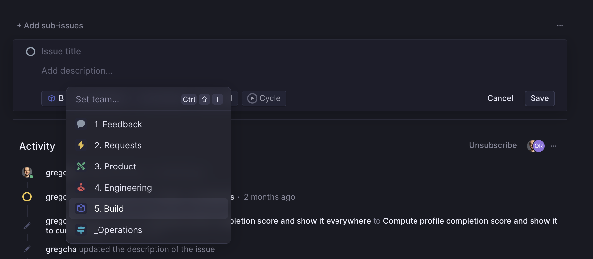

# Choosing a task to work on

## Types of tasks

### Bugs

*Bugs* should be taken in priority when possible.
They can be found in the *Backlog* column of the *Engineering* board.

### Features

*Features* can also be found in the *Backlog* column of the *Engineering* board, and are sorted in descending priority order.

#### Feature specification

It can be useful to write a breakdown of the necessary steps to complete a task.

This can either be done in the Engineering ticket itself or by creating subtasks in the *Build* board.

Creating subtasks can be achieved by clicking the *Add sub-issues* button on the ticket.

Don't forget to choose the *Build* board as shown below:

### Tech tasks

Tech tasks can be linked to refactoring, perf issues, etc...

They usually have less priority than other features.

#### Spike

A spike is a task that is meant to start in to investigation into a complex topic (ex: setting up a new tools, investigating logging costs ...).

It is usually timeboxed to one day and should result in creating other tasks with more concrete steps to take.

### Snack

A snack is a short task that should be completed in one or two hours.
